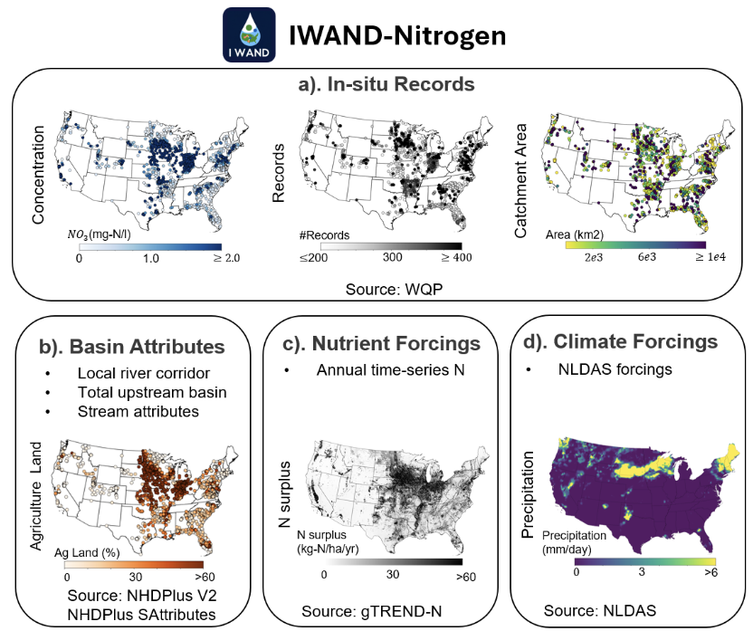

# IWAND-Nitrogen
 

Water quantity predictions have made tremendous progress, from model development to gaining new knowledge through Large-Sample Hydrology (LSH), going beyond single-case studies and individual rivers. The backbone behind such progress is the availability of a ready-to-use benchmarks. Here, we developed the Integrated Watershed Attributes, and Nutrient Data for Nitrogen (IWAND-Nitrogen) dataset for the contiguous United States. The IWAND-Nitrogen dataset includes nearly 574,767 in-situ nitrogen (NO3) records from 1,877 different catchments, each with at least 200 measurements from 1980 to 2023. This dataset pairs 88 watershed attributes for both the total upstream area and local corridor, 8 time-series nitrogen input forcings, and 11 climate forcings. Our vision for IWAND is to serve as a nutrient data benchmark for the water quality community, facilitating accurate modelling, deeper physical understanding, and better adaptive strategies
We provide our methodology code, which includes: 
## (1) In-situ data extraction
Nationwide gauge metadata and associated measurements for NO3 were collected from the Water Quality Portal (WQP) using the “wqTools” R package.
## (2) Mapping gauges to NHDPlus flowlines
Gauges were mapped to their nearest NHDPlus V2 flowline (each indexed by a unique COMID) using the following steps:
- a) Generated hub points every 75m along flowlines with the "Points Along Geometry" tool in QGIS to minimize snapping errors.
- b) Snapped each gauge to its nearest hub point and recorded the COMID and snapping distance with the "Distance to Nearest Hub tool" in QGIS.
## (3) Watershed attribute extraction
Attributes for streams, catchments, and subcatchments were extracted from the NHDPlus V2 and the Select Attributes for NHDPlus V2.1 by linking the COMID.
## (4) Watershed boundary extraction from NHDPlus
Our approach to defining watershed boundaries relied on two key strategies: (1)  pairing gauges with watershed data from existing datasets via names/COMIDs, and  (2) developing an automatic watershed extraction algorithm for the rest to effectively handle complexities in manual watershed delineation. We applied the following:
- a) Split the gauges in each HUC into five groups based on name query (Groups I & II), COMID query (Groups III & IV), and the remaining (Group V)
## (5) Forcing time-series extraction 
Time-series N input forings from gTREND-Nitrogen and climate forcings from NLDAS2 were extracted based on watershed boundary. 

The climate forcing extraction was done using two ways: 
**Scrips/Forcing_Extraction/nldas_point_extraction.py**: For watersheds smaller than NLDAS2 grid (~0.125 degree), the forcings were extracted from coordinates of the centroid of watersheds and 
**hydroData** (https://github.com/mhpi/hydroData): Used for the larger watersheds  

## Citation:
If you find the scripts, data, or paper useful, please cite: [DOI forthcoming upon publication]
## Contact 
For questions, feedback, or to report issues with the scripts and data, please reach out to:

Shuyu Chang – shuyu.chang.hydro@gmail.com

Doaa Aboelyazeed – dmf5963@psu.edu

Kamlesh Sawadekar - kas7897@psu.edu

We welcome collaboration and feedback to improve future versions of IWAND-Nitrogen.
